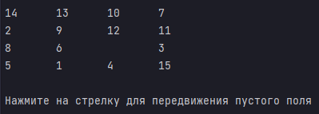

# Пятнашки

Данный проект является компьютерной реализацией данной игры.
 Предусматривается одна категория пользователей ‒ игроки.
 Главной задачей игрока в данном проекте является - расположить
значения на поле в порядке возрастания. Время на игру неограниченно.
 Вслучае расположения всех значений в правильном порядке на экран
выведится сообщение "ПОБЕДА!";

## Интерфейс и управление

Приложение не имеет графической оболочки и реализуется в
консольном окне.
 При запуске приложения пользователь видит на экране поле на
котором в случайном порядке расположены значения, которые необходимо
упорядочить в порядке возрастания.

Управление осуществляется стрелочками на клавиатуре:

- Стрелочка вверх - движение пустой ячейки "Вверх";
- Стрелочка вниз - движение пустой ячейки "Вниз";
- Стрелочка влево - движение пустой ячейки "Влево";
- Стрелочка вправо - движение пустой ячейки "Вправо".